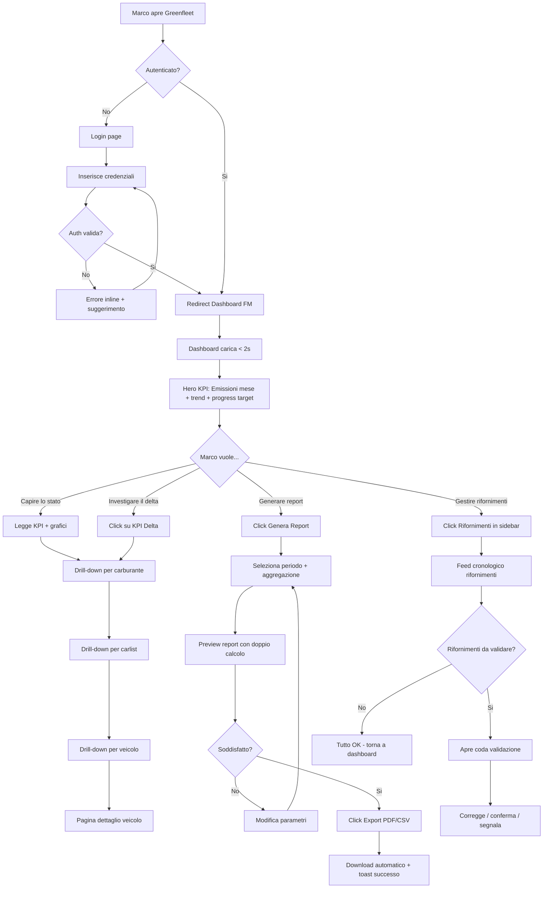
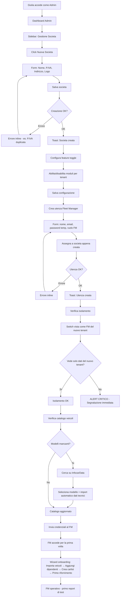
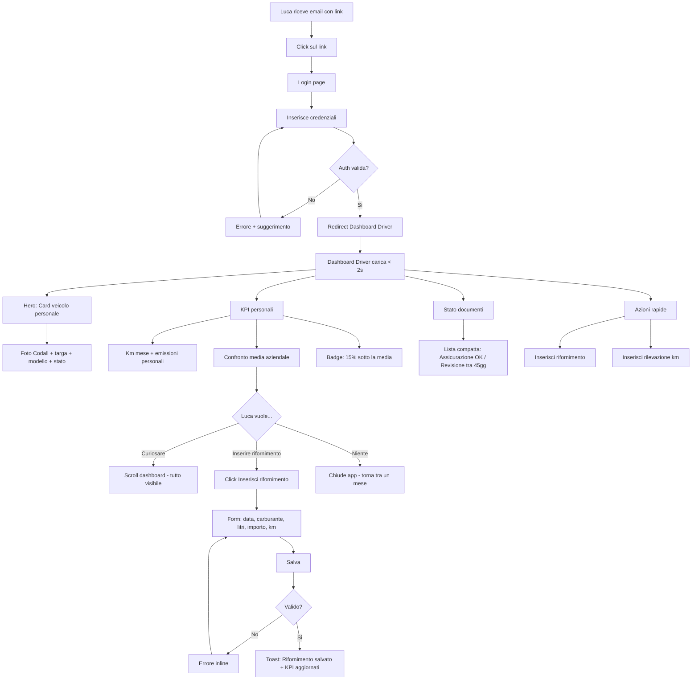

# UX Design Specification Greenfleet

**Author:** Federico
**Date:** 2026-02-07

---

## Executive Summary

### Project Vision

Greenfleet e una piattaforma SaaS B2B multitenant per il monitoraggio e la certificazione delle emissioni delle flotte aziendali. Il posizionamento non e "gestisco la flotta" ma "certifico le emissioni della flotta" — spostando il valore percepito da Operations a Sustainability/Finance.

Il differenziatore core e il doppio calcolo emissioni (teorico da dati tecnici InfocarData + reale da rifornimenti) con delta analysis, progresso vs target configurabile, e export ESG-ready. Nessun competitor copre sia l'operativita flotta che la certificazione emissioni.

Il primo cliente migra da un tool PDF attuale troppo complesso e lento. L'MVP deve essere piu veloce, piu semplice, e produrre report certificabili. Flotte da 100 a 500 veicoli, stack Docker + SQL Server, API-first.

### Target Users

**Marco (Fleet Manager) — Il power user**
42 anni, gestisce 280 veicoli per una societa di servizi. Ogni trimestre passa 3 giorni a raccogliere dati da Excel, email e PDF per produrre il report emissioni. Vive nel terrore di sbagliare un numero. Vuole velocita, chiarezza, report certificabili in 2 minuti. Le sue frustrazioni: data entry massivo, riconciliazione fatture manuale, tool PDF lento. Ha pieni poteri operativi sul proprio tenant (CRUD dipendenti, veicoli, contratti, carlist, rifornimenti, report).

**Giulia (Admin) — La custode della piattaforma**
35 anni, dipendente della societa che gestisce Greenfleet. Gestisce tenant, catalogo veicoli globale (InfocarData), fattori di emissione, regole matching default, provisioning utenti. Vuole onboarding fluido nuovi clienti, verifica isolamento dati, monitoring. Cross-tenant.

**Luca (Driver) — L'utente passivo-curioso**
28 anni, agente commerciale con Toyota Yaris Hybrid aziendale. Non gli interessa la gestione flotta, ma vorrebbe sapere se la sua auto e "green". Vuole visibilita zero-effort: dashboard personale con veicolo, km, emissioni personali, stato documenti, confronto con media aziendale. Puo inserire rifornimenti e rilevazioni km per il proprio veicolo.

### Key Design Challenges

1. **Complessita nascosta sotto semplicita** — 45 requisiti funzionali, contratti polimorfici a 4 tipi (pattern matrioska), multi-engine per ibridi/bi-fuel, matching fatture XML configurabile... tutto deve sentirsi semplice e naturale. Il Fleet Manager non deve pensare "che form complessa", deve pensare "ha gia capito cosa mi serve".

2. **Tre utenti, tre esperienze radicalmente diverse** — Il Fleet Manager vive in tabelle, filtri e report. Il Driver vede una dashboard personale e basta. L'Admin configura e monitora. Lo stesso prodotto deve parlare tre lingue UX diverse mantenendo coerenza visiva.

3. **Data density senza overwhelm** — Dashboard con KPI emissioni, grafici trend, progress bar target, notifiche, stato flotta. Il rischio "cockpit di aereo" e altissimo. Serve gerarchia visiva impeccabile con progressive disclosure.

4. **Import/data entry massivo senza sofferenza** — 200+ veicoli, centinaia di rifornimenti. Upload CSV con drag & drop, preview e validazione. Form polimorfici che si adattano al tipo contratto. Zero sorprese, zero perdita dati.

### Design Opportunities

1. **UX fintech per fleet management** — Ispirazione Stripe/Revolut: "balance sheet" emissioni come hero element, feed cronologico rifornimenti, spending insights. Nessun competitor fleet ha questa estetica. Vantaggio competitivo visivo immediato.

2. **Il delta teorico/reale come "aha moment"** — Il confronto emissioni teoriche vs reali e il momento in cui Marco capisce il valore del prodotto. Merita trattamento visivo da protagonista: non un numero in tabella, ma una visualizzazione che racconta una storia.

3. **Zero-click value per il Driver** — Luca apre l'app e sa tutto senza fare niente. Dashboard personale che lo fa sentire informato, non controllato. Confronto "sei il 15% sotto la media" come gamification elegante e professionale B2B.

4. **Tema green/teal come identita** — Palette dedicata con CSS variables. Il verde comunica la missione del prodotto. Ogni sfumatura racconta "progresso", "target raggiunto", "attenzione". Dark mode nativo.

## Core User Experience

### Defining Experience

L'esperienza core di Greenfleet si articola su due azioni fondamentali che definiscono il valore del prodotto:

**1. Monitorare — "Come sta la mia flotta?"**
L'azione piu frequente del Fleet Manager: aprire Greenfleet e capire in 3 secondi lo stato della flotta. La dashboard non e una pagina — e la risposta istantanea alla domanda che Marco si pone ogni mattina. Emissioni correnti, trend, progresso vs target, anomalie. Zero click per l'informazione piu importante.

**2. Certificare — "Dammi il report"**
L'azione critica: generare un report emissioni certificabile in meno di 2 minuti. Selezione periodo, aggregazione, doppio calcolo (teorico + reale), export PDF con metodologia inclusa. Questo e il momento in cui il valore si materializza — il CFO riceve un documento che prima richiedeva 3 giorni.

**Per il Driver:** L'esperienza e puramente passiva — aprire e vedere. Dashboard personale con il proprio veicolo, km, emissioni, stato documenti. Nessuna azione richiesta per ricevere valore.

### Platform Strategy

- **Piattaforma primaria:** Web app desktop-first (Next.js 16, shadcn/ui, Tailwind CSS 4.x)
- **Input primario:** Mouse/keyboard — il Fleet Manager lavora su desktop in ufficio
- **Responsive:** Obbligatorio per il Driver (Luca apre dal telefono) e per il Fleet Manager in mobilita
- **Offline:** Non richiesto — applicazione sempre connessa
- **Deploy:** Self-hosted Docker, nessun vincolo di piattaforma cloud
- **Browser target:** Evergreen browsers (Chrome, Firefox, Edge, Safari ultimi 2 major)

### Effortless Interactions

**Drill-down nei report** — Dal totale emissioni flotta → per carburante → per carlist → per veicolo → singoli rifornimenti. Ogni click rivela un livello sotto senza perdere il contesto sopra. Navigazione fluida dal macro al micro, breadcrumb sempre visibile.

**Import CSV** — Drag & drop sulla zona di upload, preview istantanea con evidenziazione errori riga per riga, colonne auto-mappate, conferma e processamento. 10.000 righe in meno di 30 secondi. Zero configurazione per formati standard.

**Selezione veicolo dal catalogo InfocarData** — Cascade Marca → Modello → Allestimento con search-as-you-type. Alla selezione, dati tecnici, motori, emissioni CO2 e immagine si auto-compilano. Il Fleet Manager non copia mai un dato tecnico a mano.

**Form contratto polimorfico** — Scelgo il tipo (Proprietario, Breve Termine, Lungo Termine, Leasing), il form si adatta mostrando solo i campi rilevanti. Pattern Record Type collaudato. Nessun campo inutile visibile, nessuna confusione.

**Tenant context automatico** — L'utente non sceglie mai il tenant. E estratto dalla sessione. Ogni dato, ogni query, ogni report e gia filtrato. L'isolamento e invisibile ma assoluto.

### Critical Success Moments

**1. "Aha moment" del Fleet Manager** — Marco vede per la prima volta il delta emissioni teoriche vs reali. Scopre che i commerciali diesel consumano il 9% piu del previsto. Questo e il momento "non posso piu vivere senza questo tool". Se la visualizzazione e piatta, l'insight si perde. Se racconta una storia, cambia tutto.

**2. Primo report generato** — In 2 minuti, certificabile, con metodologia e fattori di emissione inclusi. Il CFO lo legge senza chiedere spiegazioni. Se questo funziona, il cliente resta per sempre.

**3. Primo login del Driver** — Luca vede la sua auto (con foto Codall), i suoi km, le sue emissioni, il confronto con la media aziendale. Senza aver fatto niente. "Ah, comodo." Se trova una pagina vuota o un errore, non torna mai piu.

**4. Onboarding nuovo tenant** — Giulia crea la societa, il Fleet Manager importa i veicoli, in 2 ore e operativo con il primo report di test. Se questo richiede piu di mezza giornata, non arrivano nuovi clienti.

### Experience Principles

1. **Valore immediato, zero attesa** — L'informazione piu importante e sempre la prima cosa che l'utente vede. Nessuna pagina vuota, nessun "caricamento in corso" prolungato, nessun setup prima del valore. La dashboard parla prima che l'utente chieda.

2. **Complessita progressiva** — L'interfaccia mostra solo cio che serve nel contesto attuale. I dettagli emergono on-demand. Il Fleet Manager principiante e il power user usano lo stesso strumento, ma vedono profondita diverse. Progressive disclosure come principio cardine.

3. **Dati che raccontano storie** — I numeri da soli non bastano. Ogni KPI ha un trend, ogni metrica ha un confronto, ogni anomalia ha un contesto. Il delta emissioni non e "+9%" — e "i commerciali diesel di Milano consumano piu del previsto, ecco dove e perche".

4. **Fiducia attraverso trasparenza** — Marco vive nel terrore di sbagliare un numero. Ogni calcolo mostra la metodologia, ogni report include la fonte dei dati, ogni modifica e tracciata con audit trail. L'utente si fida del sistema perche puo sempre verificare.

## Desired Emotional Response

### Primary Emotional Goals

**Marco (Fleet Manager) — Dalla paura alla padronanza:**
Marco oggi ha paura di sbagliare un numero, di perdere mezza giornata su Excel, di non avere la risposta pronta per il CFO. Greenfleet deve trasformare quella paura in padronanza — la sensazione di avere tutto sotto controllo, di fidarsi dei numeri, di rispondere "te lo mando in 2 minuti" e farlo davvero.

**Giulia (Admin) — Dal peso della responsabilita all'efficienza tranquilla:**
Giulia e responsabile di tutto: se un dato leaka tra tenant, e colpa sua. Se un onboarding va storto, e colpa sua. Greenfleet deve farla sentire sicura e in controllo — ogni azione confermata, ogni isolamento verificabile, ogni configurazione chiara.

**Luca (Driver) — Dall'indifferenza alla curiosita informata:**
Luca non ha chiesto quest'app. La prima emozione e "un'altra cosa da fare". Greenfleet deve ribaltarla in curiosita piacevole — "ah, comodo, so quanto inquino" — senza mai farlo sentire monitorato o sotto pressione.

### Emotional Journey Mapping

| Fase | Emozione da evitare | Emozione da creare |
|---|---|---|
| Primo login | Confusione, overwhelm | Chiarezza, "so dove andare" |
| Dashboard quotidiana | Ansia da troppi dati | Padronanza calma, "tutto ok" |
| Import dati massivo | Paura di errori, frustrazione | Fiducia, "il sistema mi aiuta" |
| Generazione report | Terrore di sbagliare | Sicurezza, orgoglio del risultato |
| Scoperta delta emissioni | Indifferenza | Sorpresa, insight, "ecco!" |
| Errore o anomalia | Panico | Calma guidata, "so cosa fare" |
| Ritorno giornaliero | Noia, obbligo | Abitudine positiva, efficienza |

### Micro-Emotions

- **Fiducia > Scetticismo** — Marco deve fidarsi dei numeri. Ogni calcolo mostra la fonte, ogni report ha la metodologia. La trasparenza costruisce fiducia.
- **Competenza > Confusione** — Il form contratto a 4 tipi potrebbe spaventare. Il pattern Record Type deve far sentire l'utente intelligente, non perso.
- **Delizia controllata > Eccesso** — L'animazione del delta emissioni, la freccia verde del trend positivo. Micro-momenti di soddisfazione, mai circensi.
- **Orgoglio > Imbarazzo** — Quando Marco invia il report al CFO, deve sentirsi orgoglioso del documento. Formattazione impeccabile, dati chiari, metodologia inclusa.

### Design Implications

| Emozione target | Scelta UX |
|---|---|
| Padronanza calma | Dashboard con gerarchia chiara: KPI grandi, dettagli on-demand, nessun elemento che grida |
| Fiducia nei dati | Ogni metrica cliccabile per vedere la fonte. Audit trail accessibile. Tooltip "calcolato con..." |
| Sorpresa dell'insight | Delta emissioni come hero visual: barra comparativa animata con etichetta narrativa ("9% sopra il teorico") |
| Efficienza soddisfatta | Azioni completate con feedback immediato: toast di successo, contatore "47 su 47 importati", progress bar |
| Sicurezza nell'errore | Errori inline sotto il campo (non modal aggressivi), suggerimenti di correzione, undo dove possibile |
| Curiosita del Driver | Card veicolo con foto, KPI personali con confronto peer gentile ("15% sotto la media") |

### Emotional Design Principles

1. **Mai lasciare l'utente nel dubbio** — Ogni stato ha un feedback visivo: caricamento (skeleton), successo (toast verde), errore (inline rosso con suggerimento), vuoto (empty state con azione suggerita). L'utente sa sempre cosa sta succedendo.

2. **Celebrare i risultati, non nasconderli** — Report generato? Mostra un summary con highlight. Target raggiunto? Progress bar piena con badge. Import completato? Contatore con riepilogo. Ogni azione completata merita un riconoscimento proporzionato.

3. **Errori come opportunita, non punizioni** — Messaggi di errore che spiegano cosa fare, non cosa e andato storto. "La riga 47 ha la targa in formato diverso — vuoi correggere o skippare?" invece di "Errore formato riga 47".

4. **Rispettare l'attenzione dell'utente** — Notifiche solo se azionabili. Alert solo se richiedono intervento. Dashboard che si legge in 3 secondi. Il tempo di Marco e prezioso — ogni elemento superfluo e un furto.

## UX Pattern Analysis & Inspiration

### Inspiring Products Analysis

**1. Stripe Dashboard — L'arte di rendere i numeri leggibili**
Hero metric in grande (ricavi totali), trend con freccia, sparkline 12 mesi. Drill-down fluido: totale → per prodotto → per transazione. Ogni numero e cliccabile e contestualizzato.
*Per Greenfleet:* La dashboard emissioni del Fleet Manager. Emissioni totali del mese in grande, freccia trend, progress bar target. Il "balance sheet delle emissioni".

**2. Revolut — Il feed che ti fa sentire il polso**
Transaction feed cronologico con icone, importi, stato (verde/rosso/giallo). Filtri rapidi, search istantaneo. Spending insights automatici ("hai speso il 18% in piu in ristoranti").
*Per Greenfleet:* Il feed rifornimenti. Icona carburante, targa, quantita, importo, stato matching. Marco "sente il polso" della flotta scrollando.

**3. Salesforce — Il Record Type che scala**
Account page: header con dati chiave + sidebar KPI + related lists sotto. Record Type: selezione tipo all'inizio, form che si adatta. Activity timeline: feed cronologico di tutti gli eventi su un record.
*Per Greenfleet:* La pagina dettaglio veicolo (header con foto + targa + stato, sidebar con KPI emissioni, tab sotto). I contratti polimorfici come Record Type.

**4. Linear — La produttivita senza attrito**
Command palette Cmd+K: navigazione istantanea. Interfaccia minimal ma potente: nessun elemento decorativo superfluo. Transizioni fluide, stato sempre chiaro.
*Per Greenfleet:* L'efficienza del Fleet Manager che gestisce 280 veicoli. Cercare "FR779VT" e atterrare sul veicolo in 1 secondo.

### Transferable UX Patterns

**Navigazione:**
- **Sidebar collassabile** (Stripe/Linear) — Moduli nella sidebar sinistra, collassabile per piu spazio dati. Breadcrumb sempre visibile per contesto.
- **Drill-down contestuale** (Stripe) — Click su KPI → dettaglio per carburante → per carlist → per veicolo. Senza mai perdere il "dove sono".

**Interazione:**
- **Feed cronologico** (Revolut) — Rifornimenti come transaction feed. Stato matching come badge colorato. Scrollabile e filtrabile.
- **Record Type dinamico** (Salesforce) — Contratti: scelgo tipo, form si adatta. Collaudato su milioni di utenti.
- **Inline editing** (Notion) — Dove possibile, modificare senza aprire un form dedicato. Click su campo → edit inline → salva.

**Visualizzazione dati:**
- **KPI cards con trend** (Stripe) — Numero grande, freccia trend, sparkline. Per emissioni, km, rifornimenti.
- **Barra comparativa doppia** (custom Greenfleet) — Emissioni teoriche vs reali affiancate, delta evidenziato. Il visual che nessun competitor ha.
- **Progress bar con milestone** (fitness tracker) — Progresso vs target emissioni. 62% del target annuale. Verde se on-track, arancione se a rischio.

### Anti-Patterns to Avoid

- **Dashboard cockpit** — Troppi widget, troppi numeri, zero gerarchia. Soluzione: massimo 4-5 KPI visibili, il resto on-demand.
- **Form infinite a pagina singola** — 15+ campi su una pagina paralizzano. Soluzione: sezioni con accordion o stepper, validazione per sezione.
- **Tabelle senza context** — 20 colonne, l'occhio non sa dove andare. Soluzione: colonne configurabili, sorting intelligente, search prominente.
- **Notifiche spam** — Ogni azione genera una notifica, l'utente ignora tutto. Soluzione: solo notifiche azionabili, categorizzate per urgenza.
- **Export nascosto** — 3 click per trovare il pulsante. Soluzione: export visibile in ogni vista tabellare.

### Design Inspiration Strategy

**Adottare direttamente:**
- KPI cards con trend (Stripe) → dashboard Fleet Manager e Driver
- Transaction feed (Revolut) → feed rifornimenti
- Record Type pattern (Salesforce) → form contratti polimorfici
- Sidebar + breadcrumb (standard SaaS B2B)

**Adattare al contesto:**
- Account page (Salesforce) → pagina veicolo con header + foto Codall + related lists, semplificata
- Drill-down (Stripe) → navigazione report emissioni con livelli dominio (carburante, carlist, veicolo)
- Progress bar (fitness) → progresso vs target emissioni con semaforo e milestone annuali

**Evitare:**
- Complessita configurazione enterprise CRM — Marco non e un admin Salesforce
- Overload visivo da financial dashboard — meno e meglio
- Gamification esplicita (badge, punti) — troppo consumer per B2B, solo confronti peer sottili

## Design System Foundation

### Design System Choice

**shadcn/ui** (Radix UI + Tailwind CSS 4.x) — sistema themeable con componenti copiabili nel progetto, completamente personalizzabili, accessibili nativamente (ARIA, keyboard navigation via Radix UI). Scelta gia consolidata nel documento architetturale.

Categoria: **Themeable System** — velocita di un design system maturo + liberta totale di personalizzazione. Ideale per sviluppatore singolo con esigenze di brand identity unica.

### Rationale for Selection

| Fattore | Valutazione |
|---|---|
| Velocita di sviluppo | Eccellente — componenti pronti (Table, Form, Card, Dialog, Select, Combobox) |
| Personalizzazione brand | Totale — componenti copiati nel progetto, modificabili liberamente |
| Accessibilita | Built-in via Radix UI (ARIA, focus management, keyboard nav) |
| Data-heavy UI | Forte — DataTable (TanStack Table), Charts (Recharts) gia integrati |
| Team singolo | Ideale — nessun overhead di design system team, componenti auto-documentati |
| Dark mode | Nativo via Tailwind dark variant + CSS variables |
| Manutenzione | Bassa — componenti nel progetto, aggiornabili selettivamente |

### Implementation Approach

**Componenti shadcn/ui da usare direttamente:**
- `DataTable` — liste veicoli, rifornimenti, contratti, utenti, audit log
- `Form` + `Input` + `Select` + `Combobox` — ogni form del sistema
- `Card` — KPI cards, vehicle card, dashboard widgets
- `Dialog` + `Sheet` — modal conferma, dettagli rapidi, side panels
- `Chart` — grafici emissioni (bar, line, area, pie via Recharts)
- `Toast` — feedback azioni (successo, errore, info)
- `Tabs` — dettaglio veicolo (dati, motori, contratti, km, documenti)
- `Breadcrumb` — navigazione contestuale
- `Sidebar` — navigazione principale

**Componenti custom da creare (non in shadcn/ui):**
- `KPICard` — card con hero metric + trend arrow + sparkline (ispirazione Stripe)
- `DeltaBar` — barra comparativa doppia emissioni teoriche vs reali
- `ProgressTarget` — progress bar con milestone per target emissioni
- `FuelFeed` — feed cronologico rifornimenti stile Revolut
- `VehicleHeader` — header pagina veicolo con foto Codall + dati chiave
- `StatusBadge` — badge stato matching/contratto/documento con colori semantici
- `EmptyState` — stati vuoti con illustrazione e azione suggerita

### Customization Strategy

**Palette Greenfleet:**
- Primaria: toni **green/teal** — identita "fleet + sostenibilita"
- CSS variables per tematizzazione globale via Tailwind CSS 4.x
- Generazione palette con tweakcn o Shadcn Theme Generator
- Colori semantici: verde (positivo/on-track), arancione (attenzione/warning), rosso (critico/errore), blu (informativo/neutro)

**Tipografia:**
- Font system stack o Inter/Geist — pulizia, leggibilita ottimale per tabelle e dati numerici
- Scale tipografico coerente per gerarchia visiva (KPI hero → heading → body → caption)

**Dark mode:**
- Supportato nativamente via Tailwind dark variant
- Toggle nell'header utente
- Palette dark derivata automaticamente da CSS variables

**Spaziatura e Layout:**
- Grid system Tailwind per layout responsive
- Spacing scale coerente (4px base)
- Breakpoints: mobile (< 768px per Driver), tablet, desktop (primario per Fleet Manager/Admin)

## Defining Experience

### The Core Interaction

> "Vedo le emissioni della mia flotta — teoriche e reali — e capisco subito dove intervenire."

Questa e la defining experience di Greenfleet. Non e il CRUD, non e l'import, non e nemmeno il report. E l'istante in cui Marco apre la dashboard, vede il delta tra emissioni teoriche e reali, e ha un insight azionabile. Il report e la conseguenza — la dashboard e la causa per cui torna ogni giorno.

### User Mental Model

**Come Marco risolve il problema oggi:**
Un foglio Excel con targhe in colonna, litri riforniti copiati dalle fatture PDF, km letti dai contachilometri (a volte aggiornati, a volte no). Formula per calcolare gCO2e/km x km. Copia-incolla in un PDF. 3 giorni di terrore e noia.

**Cosa si aspetta da Greenfleet:**
"Apro, vedo. I dati ci sono gia perche li ho importati. I numeri sono giusti perche il sistema calcola. Il report lo genero con un click. Io devo solo capire e decidere, non raccogliere e calcolare."

**Dove si confonde:**
- Il delta teorico/reale: "Quale dei due e quello giusto?" → Educazione inline: tooltip, etichette chiare, spiegazione della metodologia
- Contratti polimorfici: "Quale tipo scelgo?" → Guida contestuale: descrizione breve per ogni tipo, esempi
- Import CSV: "Il mio file funzionera?" → Preview + validazione prima dell'import

### Success Criteria

| Criterio | Target |
|---|---|
| Tempo dal login all'insight | < 3 secondi (dashboard gia caricata) |
| Comprensione del delta | L'utente capisce "teorico vs reale" senza spiegazioni esterne |
| Drill-down al dettaglio | Da totale a singolo veicolo in max 3 click |
| Generazione report | < 2 minuti dall'apertura alla PDF scaricata |
| Fiducia nei numeri | L'utente non ricontrolla su Excel — si fida |
| Ritorno giornaliero | Il Fleet Manager apre Greenfleet ogni mattina come routine |

### Novel UX Patterns

**Pattern familiari (nessuna educazione necessaria):**
- Dashboard con KPI cards → standard SaaS B2B
- DataTable con sorting/filtering → l'utente sa gia come funzionano
- Form con validazione inline → standard web consolidato
- Sidebar navigation → pattern universale

**Twist unico di Greenfleet — Il Delta come Hero:**
La barra comparativa doppia (teorico vs reale) e un pattern nuovo per il dominio fleet. E la "swipe" di Greenfleet — l'interazione che nessun competitor offre. Due barre affiancate con etichette "Teorico" e "Reale" + delta percentuale sono auto-esplicative. Ma il valore che comunicano e rivoluzionario: Marco scopre che i commerciali diesel consumano il 9% piu del previsto, e ha un insight che prima richiedeva 3 giorni di lavoro manuale.

### Experience Mechanics

**1. Iniziazione — Login e Dashboard**
Marco apre Greenfleet → middleware auth → redirect a dashboard. La dashboard carica in < 2 secondi (RSC streaming, dati pre-cached). Hero section: emissioni totali mese corrente (numero grande), freccia trend vs mese precedente, progress bar target annuale.

**2. Interazione — Esplorazione del Delta**
KPI card "Delta Emissioni" prominente: barra teorico + barra reale + percentuale. Click sulla card → drill-down per tipo carburante (bar chart stacked). Click su un tipo → drill-down per carlist (tabella con sparkline). Click su una carlist → lista veicoli con delta individuale. Click su un veicolo → pagina dettaglio con storico rifornimenti.

**3. Feedback — L'Insight che Emerge**
Ogni livello di drill-down mostra il contesto: "Stai guardando: Diesel → Carlist Commerciali → 45 veicoli". Anomalie evidenziate con colore (rosso per delta > 15%, arancione > 10%). Tooltip su ogni dato: "Calcolato con fattore ISPRA 2026, fonte: 47 rifornimenti nel periodo".

**4. Completamento — Azione o Report**
Marco ha capito il problema: torna alla dashboard arricchito dall'insight. Oppure: click "Genera Report" → selezione periodo e aggregazione → preview → export PDF/CSV. Il report include metodologia, fattori usati, periodo, confini organizzativi. Toast: "Report generato — scaricato automaticamente".

## Visual Design Foundation

### Color System

**Palette Primaria — Greenfleet Identity**

Il verde non e decorativo — e il messaggio. Un teal sofisticato che dice "sostenibilita seria, non greenwashing".

| Token | Colore | HSL | Uso |
|---|---|---|---|
| `--primary` | Teal 600 | `hsl(168, 76%, 28%)` | Azioni primarie, sidebar attiva, link, focus ring |
| `--primary-foreground` | White | `hsl(0, 0%, 100%)` | Testo su primary |
| `--primary-hover` | Teal 700 | `hsl(168, 76%, 22%)` | Hover su primary buttons |
| `--primary-soft` | Teal 50 | `hsl(168, 60%, 96%)` | Background highlight, selezione riga |

**Palette Semantica:**

| Token | Colore | Uso |
|---|---|---|
| `--success` | Emerald 500 `hsl(152, 69%, 40%)` | On-track, trend positivo, matching OK, target raggiunto |
| `--warning` | Amber 500 `hsl(38, 92%, 50%)` | Attenzione, delta 10-15%, scadenza vicina |
| `--destructive` | Red 500 `hsl(0, 72%, 51%)` | Errore, delta > 15%, scaduto, leak alert |
| `--info` | Blue 500 `hsl(217, 91%, 60%)` | Informativo, tooltip, link secondari |

**Palette Neutra:**

| Token | Light mode | Dark mode | Uso |
|---|---|---|---|
| `--background` | `hsl(0, 0%, 100%)` | `hsl(222, 47%, 8%)` | Sfondo pagina |
| `--card` | `hsl(0, 0%, 100%)` | `hsl(222, 47%, 11%)` | Card, dialog |
| `--muted` | `hsl(210, 40%, 96%)` | `hsl(215, 25%, 15%)` | Sfondo secondario, sidebar |
| `--muted-foreground` | `hsl(215, 16%, 47%)` | `hsl(215, 16%, 65%)` | Testo secondario, caption |
| `--border` | `hsl(214, 32%, 91%)` | `hsl(215, 25%, 20%)` | Bordi, separatori |
| `--foreground` | `hsl(222, 47%, 11%)` | `hsl(210, 40%, 96%)` | Testo primario |

**Colori per Grafici Emissioni (Recharts):**

| Serie | Colore | Significato |
|---|---|---|
| Emissioni teoriche | Teal 400 `hsl(168, 65%, 45%)` | Il riferimento tecnico |
| Emissioni reali | Slate 500 `hsl(215, 16%, 47%)` | Il dato misurato |
| Delta positivo | Emerald 400 | Sotto il teorico (bene) |
| Delta negativo | Red 400 | Sopra il teorico (attenzione) |
| Diesel | `hsl(215, 25%, 40%)` | Grigio-blu scuro |
| Benzina | `hsl(38, 80%, 55%)` | Ambra |
| Elettrico | `hsl(168, 76%, 40%)` | Teal |
| GPL/Metano | `hsl(262, 50%, 55%)` | Viola |
| Ibrido | `hsl(152, 55%, 45%)` | Emerald |

### Typography System

**Font primario: Inter**
Progettato per schermi, eccellente leggibilita a tutte le dimensioni, numeri tabulari per tabelle e KPI, supporto completo caratteri europei. Fallback: `system-ui, -apple-system, sans-serif`.

**Scale tipografico:**

| Token | Size | Weight | Line Height | Uso |
|---|---|---|---|---|
| `hero` | 36px / 2.25rem | 700 bold | 1.1 | KPI hero nella dashboard |
| `h1` | 28px / 1.75rem | 600 semibold | 1.2 | Titolo pagina |
| `h2` | 22px / 1.375rem | 600 semibold | 1.3 | Titolo sezione |
| `h3` | 18px / 1.125rem | 600 semibold | 1.4 | Titolo card, tab |
| `body` | 14px / 0.875rem | 400 regular | 1.5 | Testo corpo, form labels |
| `small` | 12px / 0.75rem | 400 regular | 1.5 | Caption, metadata, timestamp |
| `mono` | 13px / 0.8125rem | 500 medium | 1.4 | Targhe, codici, valori in tabella |

Numeri tabulari: `font-variant-numeric: tabular-nums` su tutte le tabelle e KPI per allineamento verticale.

### Spacing & Layout Foundation

**Base unit: 4px**
Scale: 0 (0px), 1 (4px), 2 (8px), 3 (12px), 4 (16px), 5 (20px), 6 (24px), 8 (32px), 10 (40px), 12 (48px), 16 (64px).

**Layout strutturale:**

```
+--[ Sidebar 256px ]--+--[ Content area (fluid) ]--------+
|                      |                                   |
|  Logo                |  Header (64px)                    |
|  Nav items           |  +-[ Breadcrumb ]---------------+ |
|                      |  +-[ Page content ]-------------+ |
|  Collapse toggle     |  |  max-width: 1280px           | |
|                      |  |  padding: 24px               | |
+----------------------+--+-------------------------------+-+
```

- Sidebar: 256px espansa, 64px collassata (solo icone). Sticky, 100vh
- Header: 64px, contiene breadcrumb, search, tenant badge, user menu, dark mode toggle
- Content area: fluido, max-width 1280px centrato, padding 24px
- Card spacing: gap 16px tra cards, padding interno 24px
- Table density: row height 48px, header 40px con background muted

**Principi di layout:**
1. Densita calibrata — abbastanza denso per 280 veicoli, abbastanza arioso per non soffocare. Riferimento Stripe, non Jira
2. Gerarchia spaziale — piu spazio = piu importanza. Hero KPI con margin generosi, tabelle compatte
3. Responsive breakpoints: Desktop >= 1024px (sidebar + content), Tablet 768-1023px (sidebar collassata), Mobile < 768px (sidebar nascosta, colonna singola per Driver)

### Accessibility Considerations

- Contrasto colori: WCAG 2.1 AA (4.5:1 testo, 3:1 grafici). Teal 600 su bianco = 7.2:1
- Focus visible: ring 2px solid primary con offset su ogni elemento interattivo
- Keyboard navigation: garantita da Radix UI. Tab order logico, arrow keys per navigazione interna
- Font size minimo: 12px. Body 14px per leggibilita ottimale
- Touch target: minimo 44x44px su mobile
- Color non-dipendente: informazioni via colore hanno sempre secondo indicatore (icona, testo, pattern)

## Design Direction Decision

### Design Directions Explored

Sei direzioni esplorate, ciascuna con personalita distinta:

1. **"Stripe for Emissions"** — Dashboard analitica pulita, hero KPI, molto spazio bianco. Professionale e finanziario.
2. **"Revolut Fleet"** — Feed-centric con activity stream, sidebar scura, dinamico e operativo.
3. **"Salesforce Light"** — Entity-centric con account page e related lists, strutturato e completo.
4. **"Linear Minimal"** — Command-driven, ultra clean, sidebar collassata, per power user.
5. **"Green Dashboard"** — Sustainability-forward con progress bar hero e palette dominata dal verde.
6. **"Hybrid Optimal"** — Combinazione calibrata del meglio di ogni direzione.

### Chosen Direction

**Direction 6: Hybrid Optimal** — selezionata come direzione di design.

Combinazione calibrata che prende il meglio di ciascun approccio:

- **Da Stripe:** Hero KPI con trend + sparkline in alto, griglia cards pulita per la dashboard
- **Da Revolut:** Feed cronologico rifornimenti con badge stato matching nella pagina rifornimenti
- **Da Salesforce:** Pagina veicolo come account page con header + foto Codall + tab (Dettaglio, Motori, Contratti, Rifornimenti, Km, Documenti)
- **Da Linear:** Sidebar collassabile, interfaccia pulita senza rumore visivo
- **Da Green Dashboard:** Delta bar emissioni come hero visual nella dashboard, progress target prominente
- Sidebar chiara in light mode con accento teal sulle voci attive
- Content area con max-width 1280px, densita Stripe-like

### Design Rationale

- **Professionale ma con identita:** Pulito come Stripe, ma il teal e il delta bar danno personalita unica a Greenfleet
- **Tre utenti serviti:** Il Fleet Manager ha la densita dati che serve (Stripe + Salesforce), il Driver ha il visual immediato (Green Dashboard), l'Admin ha la struttura entita (Salesforce)
- **Unicita competitiva massima:** Nessun competitor fleet ha l'estetica fintech + il delta bar emissioni + l'account page veicolo
- **Implementabilita:** Tutti i pattern scelti sono realizzabili con shadcn/ui + componenti custom definiti. Nessun componente richiede librerie esterne aggiuntive
- **Scalabilita UX:** La combinazione regge l'aggiunta di nuove feature (alert, matching engine, ESG export) senza ridisegnare il layout

### Implementation Approach

**Dashboard Fleet Manager:**
- Hero section: 3 KPI cards (emissioni totali + trend, delta teorico/reale, progress target) in riga
- Sotto: grafico area emissioni per mese (Recharts), affiancato da distribuzione per carburante (donut)
- Sotto: quick access cards (veicoli attivi, contratti in scadenza, rifornimenti recenti)

**Pagina Veicolo (Account Page):**
- Header: foto Codall (sinistra) + dati chiave inline (targa, marca/modello, stato) + KPI sidebar (emissioni, km, contratto attivo)
- Tab sotto: Dettaglio, Motori, Contratti, Rifornimenti, Rilevazioni Km, Documenti
- Ogni tab con DataTable o form specifico

**Pagina Rifornimenti:**
- Feed cronologico con badge stato matching (verde/giallo/rosso)
- Filtri rapidi in alto (periodo, carburante, veicolo)
- Azione rapida "Nuovo rifornimento" prominente

**Sidebar:**
- Light mode: background muted, voce attiva con sfondo primary-soft + bordo sinistro teal
- Collassabile a 64px (solo icone) con toggle
- Sezioni raggruppate: Operativita (Veicoli, Contratti, Dipendenti, Carlist), Dati (Rifornimenti, Rilevazioni Km), Analisi (Emissioni, Report), Config (Impostazioni)

**Dashboard Driver:**
- Card veicolo hero con foto, targa, modello
- KPI personali: km mese, emissioni personali, confronto media aziendale
- Stato documenti (scadenze) come lista compatta
- Azioni rapide: inserisci rifornimento, inserisci km

## User Journey Flows

### Journey 1: Marco — Monitoraggio e Report Emissioni

**Goal:** Dal login alla generazione di un report certificabile con insight actionable.

**Entry point:** Marco apre Greenfleet (bookmark o URL diretto) → Auth middleware → redirect a Dashboard FM.



**Informazioni per step:**

| Step | Cosa vede Marco | Cosa deve decidere | Feedback |
|---|---|---|---|
| Dashboard | 3 KPI hero + grafici + quick access | Dove andare? | KPI caricate, trend con freccia |
| Drill-down | Bar chart per carburante/carlist | Quale livello esplorare? | Breadcrumb "Dashboard > Diesel > Carlist Commerciali" |
| Report | Preview con teorico + reale + delta | Periodo e aggregazione corretti? | Preview live, numeri aggiornati |
| Export | Toast + download | Nessuna | "Report generato — scaricato automaticamente" |

**Error recovery:**
- Dashboard lenta: skeleton loading con dati parziali progressivi (RSC streaming)
- Report vuoto (nessun dato nel periodo): empty state con suggerimento "Estendi il periodo o verifica i rifornimenti inseriti"
- Export fallito: toast errore + retry automatico + fallback "Scarica CSV"

### Journey 3: Giulia — Onboarding Nuovo Tenant

**Goal:** Creare una nuova societa, configurarla, e rendere il Fleet Manager operativo in < 2 ore.

**Entry point:** Giulia accede come Admin → sezione Gestione Societa.



**Informazioni per step:**

| Step | Cosa vede Giulia | Cosa deve decidere | Feedback |
|---|---|---|---|
| Nuova societa | Form creazione con campi obbligatori | Dati corretti? | Validazione inline in tempo reale |
| Feature toggle | Checklist moduli con descrizione | Quali moduli abilitare? | Toggle con stato visibile |
| Crea FM | Form utenza con ruolo pre-selezionato | Credenziali corrette? | Toast conferma + email preview |
| Verifica isolamento | Vista "impersonate" come FM | Isolamento corretto? | Badge "Stai vedendo come: [FM name]" |
| Catalogo | Search InfocarData con cascade Marca/Modello | Modelli giusti? | Auto-fill dati tecnici + immagine |

**Error recovery:**
- P.IVA duplicata: errore inline "Questa societa esiste gia — vuoi visualizzarla?"
- Modello non trovato su InfocarData: opzione "Aggiungi manualmente" con form dati tecnici
- Credenziali inviate ma FM non accede: sezione "Utenze attive" con stato "Mai connesso" + azione "Reinvia credenziali"

### Journey 4: Luca — Primo Accesso Driver

**Goal:** Luca accede per la prima volta e riceve valore immediato senza fare nulla.

**Entry point:** Luca riceve email con link + credenziali → click → login.



**Informazioni per step:**

| Step | Cosa vede Luca | Cosa deve fare | Feedback |
|---|---|---|---|
| Dashboard | Veicolo con foto + KPI + documenti | Niente — valore zero-click | Tutto caricato, nessun setup |
| Confronto peer | Badge "15% sotto la media" | Niente — informazione passiva | Colore verde = stai bene |
| Rifornimento (opz.) | Form semplice 5 campi | Compilare e salvare | Toast + KPI aggiornati in tempo reale |

**Error recovery:**
- Nessun veicolo assegnato: empty state "Non hai ancora un veicolo assegnato. Contatta il tuo Fleet Manager."
- Foto Codall non disponibile: placeholder con icona auto + marca/modello in testo
- Credenziali errate: "Password errata. Contatta il tuo Fleet Manager per reset." (no self-service nell'MVP)

### Journey Patterns

Attraverso i tre flow emergono pattern ricorrenti da standardizzare:

**Navigation Patterns:**
- **Dashboard-first:** Ogni ruolo atterra sulla propria dashboard. Zero setup prima del valore.
- **Drill-down progressivo:** KPI → categoria → lista → dettaglio. Breadcrumb sempre visibile. Back = livello su.
- **Sidebar come mappa:** La sidebar non e solo navigazione — e l'indice del sistema. Sezioni raggruppate per dominio.

**Decision Patterns:**
- **Record Type selection:** Scelta tipo (contratto, report) all'inizio del flow → form che si adatta. Mai piu di 4 opzioni.
- **Preview before commit:** Import CSV, generazione report, export — sempre preview prima dell'azione irreversibile.
- **Cascade selection:** Marca → Modello → Allestimento per veicoli. Search-as-you-type a ogni livello.

**Feedback Patterns:**
- **Toast per azioni completate:** Verde successo, rosso errore, arancione warning. Auto-dismiss 5s per successo, persistente per errore.
- **Inline validation:** Errori sotto il campo, non in modal. Suggerimento di correzione incluso.
- **Skeleton loading:** Mai pagine bianche durante il caricamento. Skeleton con forma del contenuto atteso.
- **Empty state con azione:** Mai "Nessun dato". Sempre "Non ci sono ancora rifornimenti — Importa o inserisci il primo."
- **Badge contestuali:** Stato matching (verde/giallo/rosso), stato documenti (OK/scadenza vicina/scaduto), trend emissioni (freccia su/giu).

### Flow Optimization Principles

1. **Minimo cammino al valore** — Dashboard FM: 0 click per vedere KPI. Report: 3 click (Genera → Parametri → Export). Import: 2 click (Drag & drop → Conferma). Il Driver: 0 click per il valore core.

2. **Cognitive load ridotto** — Massimo 3-4 KPI visibili nella hero section. Dettagli on-demand via drill-down. Form con massimo 6-8 campi visibili simultaneamente (accordion per il resto).

3. **Feedback proporzionato** — Azione piccola (salva campo) = feedback piccolo (checkmark inline). Azione media (salva form) = toast. Azione grande (genera report, import CSV) = summary con contatori + toast.

4. **Error recovery gentile** — Ogni errore suggerisce cosa fare. "La riga 47 ha la targa in formato diverso — correggi o salta?" Mai solo "Errore". Undo dove possibile (annulla ultima modifica).

5. **Contesto sempre visibile** — Breadcrumb su ogni pagina. Badge tenant per Admin. Badge ruolo visibile. "Stai guardando: Diesel → Carlist Commerciali → 45 veicoli" durante il drill-down.

## Component Strategy

### Design System Components

**shadcn/ui copre ~70% delle esigenze UI di Greenfleet.** I componenti foundation (DataTable, Form, Card, Dialog, Tabs, Sidebar, Chart) gestiscono tutto il CRUD, la navigazione, e la visualizzazione dati standard.

**Componenti shadcn/ui mappati per area:**

| Area funzionale | Componenti primari |
|---|---|
| Navigazione | `Sidebar`, `Breadcrumb`, `Tabs`, `Command` |
| CRUD / Form | `Form`, `Input`, `Select`, `Combobox`, `Accordion`, `Dialog` |
| Tabelle dati | `DataTable` (TanStack Table), `DropdownMenu`, `Badge` |
| Dashboard | `Card`, `Chart` (Recharts), `Progress`, `Tooltip` |
| Feedback | `Toast`, `AlertDialog`, `Skeleton` |
| Layout | `Sheet`, `Separator`, `ScrollArea` |

**Principio di utilizzo:** Usare sempre il componente shadcn/ui nativo quando disponibile. Creare custom solo quando il pattern non esiste o la personalizzazione richiesta va oltre il theming.

### Custom Components

#### KPICard

**Purpose:** Hero metric nella dashboard — il primo numero che Marco legge ogni mattina.

**Content:** Valore numerico grande (es. "158 tCO2e"), label descrittiva, freccia trend con percentuale vs periodo precedente, sparkline 12 mesi opzionale.

**Anatomy:**
```
+------------------------------------------+
| [Icon]  Label (muted-foreground, small)  |
|                                          |
|  158 tCO2e          (hero, 36px, bold)   |
|  ▼ -8% vs mese prec.  (success, small)  |
|  [~~~~~~~~sparkline~~~~~~~~]             |
+------------------------------------------+
```

**States:** Loading (skeleton con placeholder numerico), Populated (valore + trend), No data (trattino "--" con tooltip "Nessun dato per il periodo"), Error (icona warning + "Dati non disponibili").

**Variants:** `default` (con sparkline), `compact` (senza sparkline, per griglie dense), `hero` (piu grande, per la prima card).

**Accessibility:** `role="region"`, `aria-label="Emissioni totali: 158 tonnellate CO2 equivalente, in calo dell'8% rispetto al mese precedente"`. Trend comunicato anche via testo, non solo colore.

**Composizione interna:** `Card` shadcn + typography custom + `Recharts` sparkline + icona Lucide per trend arrow.

#### DeltaBar

**Purpose:** Il visual-hero di Greenfleet — il confronto emissioni teoriche vs reali che nessun competitor offre. L'elemento che genera l'"aha moment" di Marco.

**Content:** Due barre orizzontali affiancate (teorico e reale), etichette, percentuale delta con colore semantico.

**Anatomy:**
```
+--------------------------------------------------+
|  Teorico    [████████████████░░░░]  145 tCO2e     |
|  Reale      [████████████████████]  158 tCO2e     |
|                                                    |
|  Delta: +9.0%  ▲  Reale sopra il teorico          |
+--------------------------------------------------+
```

**States:** Loading (skeleton barre), Populated (barre + delta), Delta positivo (reale > teorico → colore `destructive`), Delta negativo (reale < teorico → colore `success`), Delta neutro (±2% → colore `muted`).

**Variants:** `inline` (compatto, per righe di tabella — solo barre senza labels), `full` (con labels e descrizione, per dashboard e dettaglio), `mini` (solo percentuale + freccia, per KPICard).

**Accessibility:** `aria-label="Emissioni teoriche: 145 tonnellate. Emissioni reali: 158 tonnellate. Delta: piu 9 percento, reale sopra il teorico"`. Barre con `role="meter"`, valori comunicati via testo.

**Composizione interna:** Div con Tailwind (barre CSS, nessuna libreria chart) + Typography + Badge delta.

#### ProgressTarget

**Purpose:** Progresso verso il target emissioni configurato — il "quanto manca" che Marco guarda ogni settimana.

**Content:** Barra progresso con percentuale, milestone (trimestri), colore semantico per on-track/at-risk/off-track, label target.

**Anatomy:**
```
+--------------------------------------------------+
|  Target annuale: 200 tCO2e                        |
|  [████████████████████░░░░░░░░░░]  62%            |
|   Q1 ✓     Q2 ✓     Q3 •     Q4 ○               |
|  On track — 124 tCO2e su 200                      |
+--------------------------------------------------+
```

**States:** On-track (verde, <= 100% proiezione lineare), At-risk (arancione, 100-115% proiezione), Off-track (rosso, > 115% proiezione), No target (muted, "Nessun target configurato — Imposta").

**Variants:** `full` (con milestones trimestrali), `compact` (solo barra + percentuale).

**Accessibility:** `role="progressbar"`, `aria-valuenow`, `aria-valuemin`, `aria-valuemax`, `aria-label="Progresso target emissioni: 62%, 124 tonnellate su 200, on track"`.

**Composizione interna:** `Progress` shadcn esteso + milestone dots + Badge stato + Typography.

#### FuelFeed

**Purpose:** Feed cronologico rifornimenti stile Revolut — Marco "sente il polso" della flotta scrollando.

**Content:** Lista cronologica di rifornimenti con icona carburante, targa veicolo, quantita, importo, stato matching.

**Anatomy (singolo item):**
```
+--------------------------------------------------+
| [⛽]  FR779VT  |  Diesel  |  45.2L  |  €67.80   |
|       12 gen 2026, 08:45   [● Validato]           |
+--------------------------------------------------+
```

**States item:** Validato (badge verde), Da validare (badge giallo), Anomalia (badge rosso), Inserimento manuale (badge blu).

**Actions:** Click su item → espansione inline con dettagli (km, fornitore, note). Click su targa → navigazione a pagina veicolo. Filtri rapidi in header (periodo, carburante, stato, veicolo).

**Variants:** `full` (pagina dedicata con filtri), `compact` (widget dashboard, ultimi 5 rifornimenti), `validation` (solo rifornimenti da validare, con azioni batch).

**Accessibility:** `role="feed"`, ogni item `role="article"` con `aria-label` completo. Keyboard navigation con arrow keys.

**Composizione interna:** `ScrollArea` shadcn + custom list items + `Badge` shadcn + `DropdownMenu` per azioni.

#### VehicleHeader

**Purpose:** Header della pagina dettaglio veicolo — ispirazione Salesforce Account Page. Il "biglietto da visita" del veicolo.

**Content:** Foto Codall (sinistra), dati chiave inline (targa, marca/modello, stato, dipendente assegnato), KPI sidebar (emissioni, km, contratto attivo).

**Anatomy:**
```
+--[ Foto ]---+--[ Dati chiave ]----+--[ KPI ]--------+
|             |  FR779VT             | Emissioni: 12.4 |
|   [Codall   |  Fiat 500X Cross    | tCO2e YTD       |
|    image]   |  ● Attivo           | Km: 18.400      |
|             |  → Marco Rossi      | Contratto: LT    |
|             |  Diesel 1.6 130cv   | Scade: 03/2027   |
+-------------+---------------------+-----------------+
```

**States:** Attivo (badge verde), In manutenzione (badge arancione), Dismesso (badge grigio), Foto non disponibile (placeholder con icona auto + marca/modello).

**Actions:** Click su dipendente → navigazione. Click su contratto → tab Contratti. Azioni dropdown: Modifica, Aggiungi contratto, Aggiungi rifornimento.

**Accessibility:** Foto con `alt` descrittivo ("Fiat 500X Cross, colore grigio"). Dati chiave in struttura semantica. KPI con labels esplicite.

**Composizione interna:** Layout CSS Grid + `Avatar`/`Image` shadcn + `Badge` + Typography + `DropdownMenu`.

#### StatusBadge

**Purpose:** Badge stato unificato per tutto il sistema — matching, contratti, documenti, veicoli. Un linguaggio visivo coerente.

**Content:** Dot colorato + label testuale.

**Variants per dominio:**

| Dominio | Stato | Colore | Label |
|---|---|---|---|
| Matching | Validato | `success` | Validato |
| Matching | Da validare | `warning` | Da validare |
| Matching | Anomalia | `destructive` | Anomalia |
| Documento | Valido | `success` | OK |
| Documento | In scadenza | `warning` | Scade tra Xgg |
| Documento | Scaduto | `destructive` | Scaduto |
| Contratto | Attivo | `success` | Attivo |
| Contratto | In scadenza | `warning` | Scade tra Xgg |
| Contratto | Scaduto | `destructive` | Scaduto |
| Veicolo | Attivo | `success` | Attivo |
| Veicolo | Manutenzione | `warning` | Manutenzione |
| Veicolo | Dismesso | `muted` | Dismesso |

**Accessibility:** `role="status"`, colore sempre accompagnato da testo. Screen reader legge solo il testo.

**Composizione interna:** `Badge` shadcn con dot SVG colorato + variant Tailwind.

#### EmptyState

**Purpose:** Stato vuoto con personalita — mai "Nessun dato", sempre una guida all'azione.

**Anatomy:**
```
+--------------------------------------------------+
|           [Illustrazione/Icona]                   |
|                                                    |
|  Non ci sono ancora rifornimenti                   |
|  Importa un file CSV o inserisci il primo          |
|  rifornimento manualmente.                         |
|                                                    |
|  [+ Importa CSV]   [+ Nuovo rifornimento]         |
+--------------------------------------------------+
```

**Variants:** `action` (con bottoni CTA), `info` (solo messaggio, es. "Nessun risultato per i filtri applicati — Rimuovi filtri"), `permission` (dati non accessibili — "Non hai accesso a questa sezione").

**Composizione interna:** Layout centrato + icona Lucide + Typography + `Button` shadcn.

### Component Implementation Strategy

**Principi guida:**
1. **Token-first:** Ogni componente custom usa i CSS variables di Greenfleet (`--primary`, `--success`, `--destructive`, etc.). Zero colori hardcoded.
2. **Composizione > Ereditarieta:** I custom components compongono shadcn/ui primitives, non li estendono. `KPICard` usa `Card` + `Tooltip` + Recharts, non una `Card` modificata.
3. **Server Component by default:** Componenti che leggono dati sono RSC. Solo quelli con interattivita (filtri, toggle, form) sono Client Component.
4. **Colocation:** Ogni custom component in `src/components/` con file: `component.tsx` + `component.stories.tsx` (se Storybook futuro).

**Struttura directory:**

```
src/components/
├── ui/                    # shadcn/ui components (generati)
│   ├── button.tsx
│   ├── card.tsx
│   ├── data-table.tsx
│   └── ...
├── dashboard/             # Componenti dashboard
│   ├── kpi-card.tsx
│   ├── delta-bar.tsx
│   └── progress-target.tsx
├── fleet/                 # Componenti dominio flotta
│   ├── vehicle-header.tsx
│   ├── fuel-feed.tsx
│   └── fuel-feed-item.tsx
└── shared/                # Componenti riusabili cross-dominio
    ├── status-badge.tsx
    └── empty-state.tsx
```

### Implementation Roadmap

**Fase 1 — Core (necessari per journey Marco + Luca):**

| Componente | Journey servita | Priorita |
|---|---|---|
| `KPICard` | Dashboard FM + Dashboard Driver | Critica |
| `DeltaBar` | Dashboard FM, drill-down emissioni | Critica |
| `StatusBadge` | Tutte le tabelle, feed, header | Critica |
| `EmptyState` | Ogni vista vuota del sistema | Critica |
| `VehicleHeader` | Pagina dettaglio veicolo | Alta |

**Fase 2 — Growth (necessari per feed e operativita):**

| Componente | Journey servita | Priorita |
|---|---|---|
| `FuelFeed` | Pagina rifornimenti, dashboard widget | Alta |
| `ProgressTarget` | Dashboard FM, sezione report | Alta |

**Fase 3 — Enhancement (ottimizzazione UX post-MVP):**

| Componente | Journey servita | Priorita |
|---|---|---|
| Varianti `compact` di KPICard e DeltaBar | Tabelle con inline KPI | Media |
| Variante `validation` di FuelFeed | Coda matching fatture (post-MVP) | Media |

## UX Consistency Patterns

### Button Hierarchy

**Gerarchia a 4 livelli:**

| Livello | Stile | Uso | Esempio |
|---|---|---|---|
| Primary | `bg-primary text-primary-foreground` | Azione principale della pagina — una sola per vista | "Genera Report", "Salva veicolo", "Importa CSV" |
| Secondary | `bg-secondary text-secondary-foreground` | Azioni secondarie complementari | "Annulla", "Salva bozza", "Esporta CSV" |
| Ghost | `hover:bg-accent` | Azioni terziarie, toolbar, filtri | "Filtri", "Colonne", icone azione in riga tabella |
| Destructive | `bg-destructive text-destructive-foreground` | Azioni irreversibili — sempre con conferma | "Elimina veicolo", "Rimuovi contratto" |

**Regole:**
- **Una sola Primary per vista.** Se ci sono 2 azioni importanti, una e Primary e l'altra e Secondary.
- **Destructive sempre con Dialog di conferma.** Testo esplicito: "Stai per eliminare il veicolo FR779VT. Questa azione non e reversibile."
- **Posizione:** Primary a destra, Secondary a sinistra. In form: Primary in basso a destra, annulla a sinistra.
- **Stato disabled:** `opacity-50 cursor-not-allowed` + tooltip che spiega perche ("Compila i campi obbligatori").
- **Loading:** Spinner interno al bottone + testo che cambia ("Salva" → "Salvataggio..."). Il bottone diventa disabled durante l'azione.

**Mobile:** Touch target minimo 44x44px. Bottoni full-width su mobile per form. Floating action button per "Nuovo rifornimento" nella vista Driver.

### Feedback Patterns

**Matrice feedback per tipo di azione:**

| Tipo azione | Feedback | Componente | Durata |
|---|---|---|---|
| Salvataggio campo inline | Checkmark verde accanto al campo | Icona inline | 2s poi svanisce |
| Salvataggio form | Toast verde "Veicolo salvato" | `Toast` | Auto-dismiss 5s |
| Azione batch (import) | Progress bar + contatore "47/200 righe" | Progress + counter | Persistente fino al completamento |
| Azione lunga (report) | Spinner nel bottone + stato "Generazione in corso..." | Button loading | Persistente |
| Errore campo | Testo rosso sotto il campo + bordo rosso | Inline error | Persistente fino a correzione |
| Errore form | Toast rosso + scroll al primo campo con errore | `Toast` + scroll | Persistente (click per dismiss) |
| Errore sistema | Banner rosso in alto nella pagina | Alert banner | Persistente + azione retry |
| Warning | Toast arancione con azione opzionale | `Toast` | 8s auto-dismiss |
| Info | Toast blu con messaggio informativo | `Toast` | 5s auto-dismiss |

**Principi:**
- **Proporzionalita:** feedback piccolo per azione piccola, feedback grande per azione grande.
- **Non-bloccante:** i toast non bloccano l'interazione. Solo i Dialog di conferma sono bloccanti.
- **Stacking:** massimo 3 toast visibili contemporaneamente, i piu vecchi scompaiono.
- **Accessibilita:** toast con `role="status"` e `aria-live="polite"`. Errori con `aria-live="assertive"`.

### Form Patterns

**Layout standard:**

```
+--[ Form ]----------------------------------------+
| Titolo sezione                                    |
| ------------------------------------------------- |
| Label *          Label                             |
| [Input]          [Input]                           |
| Errore inline    Helper text                       |
|                                                    |
| Label *                                            |
| [Select ▼]                                         |
|                                                    |
| ------------------------------------------------- |
| [Annulla]                    [Salva veicolo]       |
+--------------------------------------------------+
```

**Regole:**
- **Grid a 2 colonne su desktop**, colonna singola su mobile.
- **Label sopra l'input**, mai a sinistra (migliore scansione verticale).
- **Asterisco (\*)** per campi obbligatori — nessun testo "opzionale" per gli altri.
- **Helper text** sotto l'input in `muted-foreground` per contesto (es. "Formato: AA000AA").
- **Errore inline** sostituisce l'helper text, in `destructive`. Sempre con suggerimento di correzione.
- **Validazione:** on-blur per singolo campo, on-submit per form completo. Mai on-change (troppo aggressivo).

**Pattern Record Type (contratti polimorfici):**
1. Marco seleziona il tipo contratto da un `Select` con 4 opzioni (Proprietario, Breve Termine, Lungo Termine, Leasing)
2. Ogni opzione ha una descrizione breve sotto il nome
3. Alla selezione, i campi specifici del tipo appaiono con transizione fluida
4. I campi comuni (veicolo, data inizio) restano sempre visibili
5. Cambio tipo contratto → Dialog conferma "I dati specifici del tipo precedente verranno persi"

**Pattern Import CSV:**
1. Zona drag & drop prominente con icona + testo "Trascina il file CSV qui o clicca per selezionare"
2. Dopo upload: preview tabella con prime 10 righe
3. Righe con errori evidenziate in rosso con tooltip per riga
4. Header: "200 righe — 193 valide, 7 con errori"
5. Opzioni: "Importa solo valide" (Primary) + "Correggi errori" (Secondary) + "Annulla" (Ghost)
6. Post-import: summary "193 rifornimenti importati. 7 scartati — Scarica report errori"

### Navigation Patterns

**Sidebar:**
- Sezioni raggruppate con label in `muted-foreground uppercase small`:
  - **Operativita:** Veicoli, Contratti, Dipendenti, Carlist
  - **Dati:** Rifornimenti, Rilevazioni Km
  - **Analisi:** Emissioni, Report
  - **Configurazione:** Impostazioni, Utenti
- Voce attiva: `bg-primary-soft` + bordo sinistro 3px `primary` + testo `foreground` bold
- Voce hover: `bg-accent`
- Collapse a 64px: solo icone Lucide, tooltip con nome sezione
- Badge counter sulle voci con pending items (es. "Rifornimenti" con badge "5" per da validare)

**Breadcrumb:**
- Sempre visibile sotto l'header, sopra il contenuto pagina
- Formato: `Dashboard > Emissioni > Diesel > Carlist Commerciali`
- Ogni segmento e un link cliccabile per tornare a quel livello
- Ultimo segmento in `foreground` bold (pagina corrente), precedenti in `muted-foreground`

**Drill-down:**
- Click su KPI card → pagina dettaglio con filtro pre-applicato
- Click su riga tabella → pagina dettaglio entita
- Back button del browser funziona sempre correttamente (URL routing)
- Breadcrumb riflette il percorso di navigazione, non la gerarchia statica

**Tabs (pagina dettaglio veicolo):**
- Tabs orizzontali sotto il VehicleHeader
- Tab attiva: bordo inferiore `primary` + testo bold
- Ordine fisso: Dettaglio, Motori, Contratti, Rifornimenti, Km, Documenti
- Contenuto tab non si ricarica al cambio tab (cached client-side)
- URL riflette la tab attiva (`/vehicles/123?tab=contracts`)

### Data Display Patterns

**DataTable standard:**

| Feature | Comportamento |
|---|---|
| Ordinamento | Click su header colonna → asc → desc → neutro. Icona freccia nell'header |
| Filtri | Barra filtri sopra la tabella. Filtri attivi visibili come chip rimovibili |
| Ricerca | Input search prominente in alto a destra. Debounce 300ms |
| Paginazione | Footer tabella: "Mostra 1-50 di 280" + navigazione pagine. Default 50 righe |
| Selezione righe | Checkbox a sinistra per azioni batch. Header checkbox per select all (pagina corrente) |
| Azioni riga | DropdownMenu con 3 puntini a destra. Max 5 azioni (oltre → "Altre azioni...") |
| Colonne | Configurabili via dropdown "Colonne". Ordine drag & drop. Persistenza per utente |
| Density | Row height 48px. Alternating row colors (`muted/background`) |
| Responsive | Su mobile: colonne secondarie nascoste, visibili via expand riga |

**Formattazione dati:**
- **Numeri:** Separatore migliaia con punto, decimali con virgola (locale IT). Es: `1.234,56`
- **Valute:** Simbolo € prima del numero. Es: `€ 67,80`
- **Date:** `dd MMM yyyy` per display (12 gen 2026), `dd/MM/yyyy` per input
- **Targhe:** Font `mono`, uppercase. Es: `FR779VT`
- **Emissioni:** Sempre con unita: `158 tCO2e` o `12.400 gCO2e`
- **Percentuali:** Una cifra decimale + simbolo. Colore semantico se delta: `+9,0%` rosso, `-8,0%` verde

### Loading & Empty States

**Loading:**
- **Pagina intera:** Skeleton layout che replica la struttura della pagina (card placeholder, righe tabella placeholder)
- **Componente singolo:** Skeleton dentro il componente (es. KPICard skeleton = rettangolo grigio per numero + linea per label)
- **Azione in corso:** Spinner nel bottone + testo stato. Mai spinner centrato a pagina intera.
- **Tabella:** 5 righe skeleton con altezza corretta. Mai "Caricamento..." come testo.

**Empty states per contesto:**

| Contesto | Messaggio | Azione |
|---|---|---|
| Prima visita (nessun veicolo) | "La tua flotta e vuota" | [+ Importa veicoli] [+ Aggiungi veicolo] |
| Filtri senza risultati | "Nessun risultato per i filtri applicati" | [Rimuovi filtri] |
| Ricerca senza risultati | "Nessun risultato per '[query]'" | Suggerimento: "Prova con termini diversi" |
| Nessun rifornimento nel periodo | "Nessun rifornimento nel periodo selezionato" | [Estendi periodo] [Importa rifornimenti] |
| Driver senza veicolo | "Non hai ancora un veicolo assegnato" | "Contatta il tuo Fleet Manager" |
| Errore caricamento | "Impossibile caricare i dati" | [Riprova] + testo "Se il problema persiste, contatta il supporto" |

### Modal & Overlay Patterns

**Quando usare cosa:**

| Pattern | Quando | Esempio |
|---|---|---|
| `Dialog` (modal) | Conferma distruttiva o decisione binaria | "Elimina veicolo?", "Cambia tipo contratto?" |
| `Sheet` (side panel) | Dettaglio rapido senza navigazione | Preview veicolo da tabella, dettaglio rifornimento |
| `Tooltip` | Contesto informativo on-hover | "Calcolato con fattore ISPRA 2026", "gCO2e/km x km percorsi" |
| Navigazione | Creazione/modifica completa | Form nuovo veicolo, form contratto |

**Regole modal:**
- **Mai modal dentro modal.** Se serve piu contesto, naviga alla pagina.
- **Escape chiude sempre.** Click fuori chiude il Sheet, non il Dialog (per evitare chiusure accidentali su conferme).
- **Focus trap** su Dialog e Sheet. Tab non esce dal modal.
- **Overlay** scuro semitrasparente (`bg-black/50`).

## Responsive Design & Accessibility

### Responsive Strategy

**Desktop (primario — Fleet Manager + Admin):**
- Layout completo: sidebar 256px + content area fluida (max-width 1280px)
- DataTable con tutte le colonne visibili, 50 righe per pagina
- Dashboard con griglia 3 KPI cards in riga + grafici affiancati
- Form a 2 colonne, Sheet laterali per dettagli rapidi
- Hover states, tooltip, right-click context menu

**Tablet (secondario — FM in mobilita):**
- Sidebar collassata a 64px (solo icone), espandibile con tap
- Content area full-width, max-width rimosso
- Dashboard: KPI cards in griglia 2 colonne, grafici full-width stacked
- DataTable: colonne secondarie nascoste, espandibili per riga
- Form a colonna singola, touch target 44px
- Sheet bottom invece di side panel

**Mobile (Driver-first):**
- Sidebar nascosta, accessibile via hamburger menu (top-left)
- Bottom navigation bar per le 3-4 azioni piu frequenti del Driver: Dashboard, Rifornimenti, Km, Profilo
- Dashboard Driver: layout a colonna singola, card stacked
- Form: input full-width, bottoni full-width, numpad per campi numerici (inputmode="decimal")
- Tabelle: card-view instead of table rows (ogni veicolo/rifornimento = card espandibile)
- Swipe gestures: swipe per azioni rapide su feed items (futuro)

**Approccio:** Desktop-first nel CSS (le media query adattano verso il basso), ma design mentale mobile-first per il Driver — la sua dashboard e pensata prima per 375px, poi adattata verso desktop.

### Breakpoint Strategy

| Breakpoint | Range | Tailwind | Layout |
|---|---|---|---|
| Mobile | < 768px | default | Colonna singola, sidebar nascosta, bottom nav |
| Tablet | 768px - 1023px | `md:` | Sidebar collassata 64px, griglia 2 colonne |
| Desktop | 1024px - 1279px | `lg:` | Sidebar 256px, content fluido |
| Desktop wide | >= 1280px | `xl:` | Sidebar 256px, content max-width 1280px centrato |

**Regole breakpoint:**
- **Nessun breakpoint custom.** Usare solo i breakpoint standard Tailwind per coerenza e manutenibilita.
- **Container query** per componenti che devono adattarsi al container (es. KPICard in sidebar vs in griglia dashboard). Tailwind CSS 4.x supporta `@container` nativamente.
- **No layout shift:** il passaggio tra breakpoint non deve causare spostamenti bruschi del contenuto. Transizioni CSS dove necessario.

### Accessibility Strategy

**Livello di conformita: WCAG 2.1 AA**

Motivazione: standard di settore per SaaS B2B, richiesto per compliance ESG/CSR dei clienti enterprise, realizzabile con shadcn/ui (Radix UI) senza effort aggiuntivo significativo.

**Contrasto colori:**

| Elemento | Requisito | Verifica |
|---|---|---|
| Testo body su background | 4.5:1 minimo | Teal 600 su white = 7.2:1 |
| Testo small su background | 4.5:1 minimo | Muted-foreground su white = 4.6:1 |
| Testo su primary button | 4.5:1 minimo | White su Teal 600 = 7.2:1 |
| Grafici e icone | 3:1 minimo | Tutte le serie chart verificate |
| Focus ring | 3:1 minimo | Primary ring su white = 7.2:1 |

**Keyboard navigation:**
- **Tab order:** sequenza logica top-to-bottom, left-to-right. Skip link "Vai al contenuto" come primo elemento focusabile.
- **Arrow keys:** navigazione interna a Tabs, Sidebar, DataTable, Combobox (gestito da Radix UI).
- **Enter/Space:** attivazione bottoni, selezione opzioni, toggle.
- **Escape:** chiude Dialog, Sheet, Dropdown, Combobox.
- **Focus visible:** ring 2px `primary` con offset 2px su ogni elemento interattivo. Mai `outline: none` senza alternativa.

**Screen reader:**
- **Semantic HTML:** `<nav>` per sidebar, `<main>` per content area, `<header>` per page header, `<section>` per sezioni con `aria-labelledby`.
- **ARIA landmarks:** `role="navigation"`, `role="main"`, `role="complementary"` per sidebar KPI.
- **Live regions:** `aria-live="polite"` per toast e aggiornamenti KPI, `aria-live="assertive"` per errori critici.
- **DataTable:** `role="table"`, `aria-sort` su colonne ordinabili, `aria-selected` su righe selezionate.
- **Form:** `aria-required`, `aria-invalid`, `aria-describedby` che punta a helper text o errore inline.

**Indipendenza dal colore:**
- Ogni informazione comunicata via colore ha un secondo indicatore: icona (freccia trend), testo (label stato), pattern (bordo tratteggiato per warning).
- Badge: dot colorato + testo ("Validato", "Scaduto") — il testo e sufficiente senza il colore.
- Grafici: serie differenziate anche per pattern (solid, dashed, dotted) oltre che per colore.

### Testing Strategy

**Responsive testing:**

| Dispositivo | Tool | Frequenza |
|---|---|---|
| Chrome DevTools responsive | Sviluppo quotidiano | Ad ogni componente |
| iPhone Safari (dispositivo reale) | Test mobile Driver | Ad ogni sprint |
| iPad Safari | Test tablet FM | Ad ogni sprint |
| Firefox, Edge, Safari desktop | Cross-browser | Prima di release |

**Accessibility testing:**

| Tool | Cosa verifica | Frequenza |
|---|---|---|
| eslint-plugin-jsx-a11y | ARIA attributes, alt text, roles nel codice | Ad ogni commit (CI) |
| axe-core (via Playwright) | Contrasto, struttura, ARIA runtime | Ad ogni build (CI) |
| Keyboard manual testing | Tab order, focus trap, skip links | Ad ogni nuova pagina |
| VoiceOver (macOS/iOS) | Screen reader flow completo | Prima di release |
| NVDA (Windows) | Screen reader Windows | Prima di release |

**Checklist pre-release:**
- [ ] Tutti i form navigabili solo con tastiera
- [ ] Ogni immagine ha alt text appropriato
- [ ] Contrasto verificato con axe-core: 0 violations
- [ ] Skip link funzionante
- [ ] Toast annunciati da screen reader
- [ ] DataTable navigabile con arrow keys
- [ ] Dialog/Sheet con focus trap
- [ ] Mobile: bottom nav raggiungibile con pollice
- [ ] Tablet: sidebar toggle funzionante con touch

### Implementation Guidelines

**Responsive development:**
- **Unita relative:** `rem` per font size e spacing, `%` e `vw` per layout, mai `px` per font (tranne border).
- **Immagini responsive:** `<Image>` Next.js con `sizes` attribute. Placeholder blur per Codall images.
- **Touch targets:** Minimo 44x44px su mobile. Padding generoso su link e bottoni. `@media (pointer: coarse)` per aumentare target su touch devices.
- **Viewport:** `<meta name="viewport" content="width=device-width, initial-scale=1">`. No `user-scalable=no` — l'utente deve poter zoomare.

**Accessibility development:**
- **Semantic first:** `<button>` per azioni (mai `<div onClick>`), `<a>` per navigazione, `<input>` per input. Elementi interattivi custom via Radix UI primitives.
- **Focus management:** Dopo navigazione client-side, focus sul `<h1>` della nuova pagina. Dopo apertura Dialog, focus sul primo elemento interattivo. Dopo chiusura, focus torna all'elemento che ha aperto il Dialog.
- **Reduced motion:** `@media (prefers-reduced-motion: reduce)` per disabilitare animazioni e transizioni. Sparkline e progress bar senza animazione.
- **Dark mode:** Rispetta `prefers-color-scheme` del sistema come default. Toggle manuale in header persiste in localStorage. Tutti i token colore hanno variante dark definita.
- **Language:** `<html lang="it">` per screen reader italiani. Testi di sistema in italiano.
